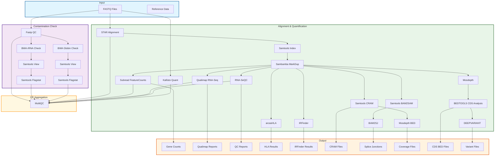

# RNA-seq Workflow (nl-rna-seq_wf)

A comprehensive Nextflow-based RNA-seq analysis pipeline for processing and analyzing RNA sequencing data, featuring quality control, alignment, quantification, and advanced analysis capabilities including IRFinder, RNA-SeQC, and Kallisto quantification.

**Current Version**: v1.1.0 - Enhanced stability and coverage analysis capabilities

## 🚀 Features

- **Quality Control**: Fastp preprocessing with rRNA and globin RNA contamination detection
- **Alignment**: STAR alignment with multiple read length optimizations (69-151bp)
- **Quantification**: 
  - STAR gene-level counts
  - Kallisto transcript-level quantification
  - Subread featureCounts for gene expression
- **Quality Metrics**: RNA-SeQC comprehensive quality assessment
- **Advanced Analysis**: 
  - IRFinder for intron retention detection
  - Splice junction analysis with BAM2SJ
  - Enhanced coverage analysis with dual Mosdepth processes (MOSDEPTH + MOSDEPTH_BED)
  - CDS region analysis and filtering with BEDTOOLS
  - Advanced variant calling with DEEPVARIANT
- **Output Formats**: CRAM compression for efficient storage
- **Containerized**: Docker-based execution for reproducibility

## 🏗️ Architecture



### 🔄 Workflow Process Flow

The pipeline follows a logical sequence where each step builds upon the previous:

1. **Quality Control & Alignment**: FASTQ files are processed and aligned to generate BAM files
2. **Coverage Analysis**: Mosdepth processes analyze coverage across the genome and coding regions
3. **CDS Region Identification**: BEDTOOLS processes the coverage data to identify coding sequences with adequate coverage
4. **Variant Calling**: DEEPVARIANT uses the BEDTOOLS-generated CDS bed file to focus variant calling on well-covered coding regions

**Key Dependency**: DEEPVARIANT requires the CDS bed file from BEDTOOLS to define the regions for variant calling, ensuring efficient and accurate variant detection in coding sequences.

## 📋 Prerequisites

### System Requirements
- **Operating System**: Linux-based (Ubuntu 18.04+ recommended)
- **CPU**: Minimum 48 cores for optimal performance
- **Memory**: Minimum 192GB RAM for STAR alignment
- **Storage**: Sufficient space for RNA-seq data processing
- **Docker**: Required for containerized execution

### Software Requirements

#### Docker
```bash
# Install Docker
curl -fsSL https://get.docker.com -o get-docker.sh
sudo sh get-docker.sh

# Add user to docker group
sudo usermod -aG docker $USER
newgrp docker

# Verify installation
docker --version
```

#### Nextflow
```bash
# Install Nextflow
curl -s https://get.nextflow.io | bash
sudo mv nextflow /usr/local/bin/

# Verify installation
nextflow -version
```

## 🛠️ Installation

1. **Clone the repository**:
```bash
git clone https://github.com/uclanelsonlab/nl-rna-seq_wf.git
cd nl-rna-seq_wf/
```

2. **Set up Docker images**:
```bash
# Build or pull required Docker images
# Update nextflow.config with your Docker image paths
```

3. **Verify installation**:
```bash
nextflow run main.nf --help
```

### Required Parameters

| Parameter | Description | Example |
|-----------|-------------|---------|
| `--fastq_r1` | Forward FASTQ file path | `/path/to/sample_R1.fastq.gz` |
| `--fastq_r2` | Reverse FASTQ file path | `/path/to/sample_R2.fastq.gz` |
| `--sample_name` | Sample identifier | `SAMPLE001` |
| `--rrna_reference` | rRNA reference genome | `/path/to/rrna_ref.fa` |
| `--globinrna_reference` | Globin RNA reference | `/path/to/globin_ref.fa` |
| `--gencode_gtf_path` | Gencode GTF annotation | `/path/to/gencode.v43.gtf` |
| `--human_fasta` | Human reference genome | `/path/to/GRCh38.fa` |
| `--star_index_151` | STAR index for 151bp reads | `/path/to/star_index_151` |
| `--kallisto_index` | Kallisto transcript index | `/path/to/kallisto.idx` |


## 📊 Output Structure

The pipeline generates organized outputs in the following structure:

```
results/
├── QC/                          # Quality control reports
│   ├── *.rrna.flagstat.txt     # rRNA contamination stats
│   ├── *.globinrna.flagstat.txt # Globin contamination stats
│   ├── *.html                  # Fastp QC reports
│   └── *.json                  # Fastp QC metrics
├── ALIGNMENT/                   # Alignment files
│   ├── *.ReadsPerGene.out.tab.gz # STAR gene counts
│   ├── *.Log.final.out         # STAR alignment stats
│   ├── *.SJ.out.tab.gz        # Splice junctions
│   ├── *.bam2SJ.out.tab.gz    # Reconstructed junctions
│   └── *.cram                  # Compressed alignment files
├── COUNTS/                      # Gene expression counts
│   ├── *.gene_id.exon.ct      # FeatureCounts output
│   └── *.gene_id.exon.ct.summary # Counts summary
├── QUANT/                       # Kallisto quantification
│   ├── *abundance.h5           # Transcript abundances h5
│   ├── *abundance.tsv           # Transcript abundances
│   └── *run_info.json           # Quantification info
├── IR/                          # IRFinder results
│   ├── *.txt.gz                # Intron retention data
│   └── *.bw                    # Coverage bigWig files
├── MOSDEPTH/                    # Coverage analysis
│   ├── *.mosdepth.global.dist.txt # Global coverage
│   ├── *.regions.bed.gz        # Region-specific coverage
│   └── *.per-base.bed.gz       # Per-base coverage analysis
├── BEDTOOLS/                    # CDS analysis and filtering
│   └── *_cds_3x.bed            # Coding sequence regions with coverage filtering
├── DEEPVARIANT/                 # Variant calling
│   ├── *.vcf.gz                # Variant call format files
│   ├── *.g.vcf.gz              # Genomic variant call format
│   └── *.visual_report.html    # Variant calling reports
└── BAM2SJ/                      # Splice junction analysis
    ├── *_rare_junctions_all.tsv # All detected junctions
    └── *_rare_junctions_filtered.xlsx # Filtered junctions
```

## 🔧 Configuration

### Docker Images
Update `nextflow.config` with your Docker image paths:
```groovy
params {
    bwa_docker = "your-registry/bwa:latest"
    star_docker = "your-registry/star:latest"
    fastp_docker = "your-registry/fastp:latest"
    // ... other images
}
```

### Resource Allocation
Modify process resources in `nextflow.config`:
```groovy
process {
    withLabel: 'star_alignreads' {
        memory = 192.GB
        cpus = 48
    }
}
```

## 🧬 Analysis Components

### 1. Quality Control (Fastp)
- Adapter trimming
- Quality filtering
- Length filtering
- Duplicate detection

### 2. Contamination Detection
- rRNA contamination using BWA
- Globin RNA contamination analysis
- Statistical reporting

### 3. Alignment (STAR)
- Multi-read length optimization
- Splice-aware alignment
- Junction detection
- Gene-level quantification

### 4. Quantification
- **STAR**: Gene-level read counts
- **Kallisto**: Transcript-level abundance
- **FeatureCounts**: Exon-level counting

### 5. Quality Assessment (RNA-SeQC)
- Coverage metrics
- GC bias analysis
- Mapping quality
- Strand specificity

### 6. Advanced Analysis
- **IRFinder**: Intron retention detection
- **BAM2SJ**: Splice junction reconstruction
- **Mosdepth**: Enhanced coverage analysis with dual processes for comprehensive coverage assessment
- **BEDTOOLS**: CDS region identification and coverage-based filtering for variant calling
- **DEEPVARIANT**: Advanced variant calling with custom model support and comprehensive reporting

**Workflow Dependencies**: DEEPVARIANT requires BEDTOOLS to run first, as it uses the generated CDS bed file to define the regions for variant calling. This ensures variant calling is focused on coding sequences with adequate coverage.

## 🐛 Troubleshooting

### Common Issues

1. **Memory Errors**:
   - Increase memory allocation in `nextflow.config`
   - Use `-resume` to restart from failed step

2. **Docker Issues**:
   - Verify Docker daemon is running
   - Check image availability and permissions

3. **Reference File Errors**:
   - Ensure all reference files are accessible
   - Verify file formats and integrity

4. **Channel Input Errors** (Fixed in v1.1.0):
   - All input channel mismatches have been resolved
   - Reference file handling has been optimized
   - Duplicate output channel issues have been fixed

## 📈 Performance

### Resource Recommendations
- **STAR Alignment**: 48 cores, 192GB RAM
- **IRFinder**: 16 cores, 32GB RAM
- **Other processes**: 8-16 cores, 16-32GB RAM

### Expected Runtime
- **Small dataset** (<50M reads): 2-4 hours
- **Medium dataset** (50-100M reads): 4-8 hours
- **Large dataset** (>100M reads): 8-16 hours

## 🤝 Contributing

We welcome contributions! Please:

1. Fork the repository
2. Create a feature branch
3. Make your changes
4. Add tests if applicable
5. Submit a pull request

## 📄 License

This project is licensed under the MIT License - see the [LICENSE](LICENSE) file for details.

## 👥 Contact

- **George Carvalho** - gcarvalhoneto@mednet.ucla.edu
- **UCLA Nelson Lab** - https://nelsonlab.ucla.edu/

## �� Acknowledgments

- Nextflow community for the workflow engine
- STAR developers for RNA-seq alignment
- IRFinder team for intron retention analysis
- All contributors to the bioinformatics tools used

---

## 📚 Additional Resources

### FRASER Analysis
For aberrant splicing analysis, see the FRASER configuration in `drop_files/config.yaml`.

### OUTRIDER Analysis
For aberrant expression analysis, use the R script in `script/run_outrider.R`.

### Batch Processing
Use the provided sample annotation files for processing multiple samples.

## 🔄 Recent Updates (v1.1.0)

### Stability Improvements
- **Fixed Channel Errors**: Resolved all input channel count mismatches across samtools processes
- **Eliminated Duplicates**: Fixed duplicate output channel naming issues
- **Optimized References**: Streamlined reference file handling for better compatibility

### Enhanced Coverage Analysis
- **Dual Mosdepth Processes**: Added comprehensive coverage analysis with both MOSDEPTH and MOSDEPTH_BED
- **Improved Integration**: Better workflow integration between coverage analysis and downstream processing
- **Performance Optimization**: Enhanced channel efficiency and process compatibility

### Advanced Variant Calling & Analysis
- **Enhanced DEEPVARIANT Integration**: Improved variant calling pipeline with optimized input handling
- **CDS Region Analysis**: Advanced BEDTOOLS processing for coding sequence identification and coverage filtering
- **Comprehensive Variant Reports**: Enhanced VCF outputs with visual reporting and gVCF support
- **Sequential Processing**: BEDTOOLS runs first to generate CDS bed files, which DEEPVARIANT then uses for targeted variant calling
- **Coverage-Based Filtering**: Variant calling is restricted to coding regions with adequate coverage, improving accuracy and efficiency

### What's New
- Pipeline now runs without channel-related errors
- Enhanced coverage analysis capabilities
- Improved stability and reliability
- Better resource utilization and workflow efficiency
- Advanced variant calling with DEEPVARIANT integration
- Enhanced CDS region analysis and filtering capabilities
- Comprehensive variant reporting and visualization

