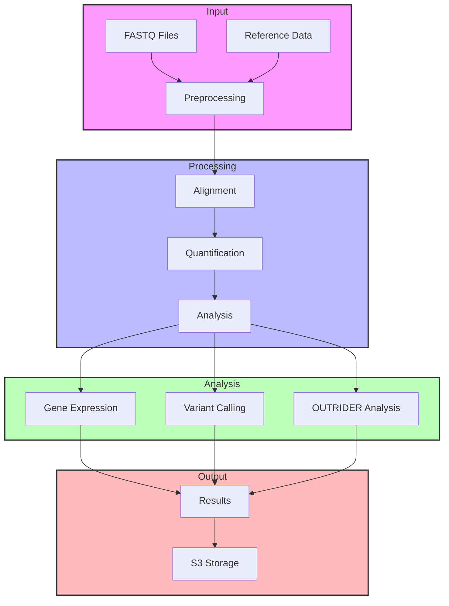

# RNA-seq Workflow (nl-rna-seq_wf)

A Nextflow-based RNA-seq analysis pipeline for processing and analyzing RNA sequencing data, with support for variant calling and OUTRIDER analysis.

## Architecture



## Overview

This RNA-seq workflow is designed to process and analyze RNA sequencing data, providing comprehensive quality control, alignment, and analysis capabilities.

## Pipeline Overview

The pipeline consists of several main stages:
- **Input**: Processing of FASTQ files and reference data
- **Preprocessing**: Quality control, filtering, and contamination checks
- **Alignment**: STAR alignment with duplicate marking and CRAM conversion
- **Analysis**: Multiple analysis steps including gene expression quantification, quality metrics, and optional variant calling
- **Output**: Generation and upload of all results

## Prerequisites

### System Requirements
- Linux-based operating system
- Minimum 36 CPU cores/nodes
- Sufficient storage for RNA-seq data processing
- AWS credentials configured for S3 access

### Software Requirements

#### Docker
```bash
# Install Docker
apt-get install ca-certificates curl
install -m 0755 -d /etc/apt/keyrings
curl -fsSL https://download.docker.com/linux/ubuntu/gpg -o /etc/apt/keyrings/docker.asc
chmod a+r /etc/apt/keyrings/docker.asc
echo "deb [arch=$(dpkg --print-architecture) signed-by=/etc/apt/keyrings/docker.asc] https://download.docker.com/linux/ubuntu $(. /etc/os-release && echo "$VERSION_CODENAME") stable" | tee /etc/apt/sources.list.d/docker.list > /dev/null
apt-get update
apt-get install docker-ce docker-ce-cli containerd.io docker-buildx-plugin docker-compose-plugin

# Verify installation
docker ps
```

#### Conda
```bash
# Install Miniconda
wget https://repo.anaconda.com/miniconda/Miniconda3-latest-Linux-x86_64.sh
bash Miniconda3-latest-Linux-x86_64.sh
# Follow the prompts and restart your shell
exec bash

# Add conda-forge channel
conda config --add channels conda-forge
```

#### Nextflow
```bash
# Install Nextflow
conda install -c bioconda nextflow
```

## Installation

1. Clone the repository:
```bash
git clone https://github.com/uclanelsonlab/nl-rna-seq_wf.git
cd nl-rna-seq_wf/
chmod u+x -R modules/
```

## Usage

### Basic Usage
```bash
nextflow run main.nf \
    --fastq_r1 <path_to_R1_fastq> \
    --fastq_r2 <path_to_R2_fastq> \
    --prefix <sample_prefix> \
    --family_id <family_id> \
    --bucket_dir <output_directory>
```

### Example Command
```bash
nextflow run main.nf \
    --fastq_r1 s3://ucla-rare-diseases/UCLA-UDN/rnaseq/fastq/BG-2024-10-15/UDN748413-2931652-MGML0088-FBR1-R1_001.fastq.gz \
    --fastq_r2 s3://ucla-rare-diseases/UCLA-UDN/rnaseq/fastq/BG-2024-10-15/UDN748413-2931652-MGML0088-FBR1-R2_001.fastq.gz \
    --prefix UDN748413-2931652-MGML0088-FBR1 \
    --family_id UDN748413 \
    --bucket_dir UDN748413-P_fibroblast_rnaseq
```

### Additional Options
- Add variant calling: `--varcall true`
- Add OUTRIDER analysis: `--outrider true --tissue ${SAMPLE_TISSUE}`
- Resume failed pipeline: Add `-resume` flag

### Batch Processing
To process multiple samples using a samplesheet:
```bash
while IFS=, read fastq1 fastq2 prefix output_bucket family_id output_directory; do
    nextflow run main.nf \
        --fastq_r1 ${fastq1} \
        --fastq_r2 ${fastq2} \
        --prefix ${prefix} \
        --family_id ${family_id} \
        --bucket_dir ${output_directory} \
        --output_bucket ${output_bucket}
    rm -r work/ results/
done < "samplesheet.csv"
```

## Output Files

The pipeline generates the following outputs:

### Quality Control
- `*.rrna.flagstat.txt`: Ribosomal contamination statistics
- `*.globinrna.flagstat.txt`: Globin RNA contamination statistics

### Alignment and Quantification
- `*.ReadsPerGene.out.tab.gz`: Gene-level read counts from STAR
- `*.ReadsPerGene.log.out`: STAR alignment log
- `*.Log.final.out`: STAR final alignment statistics
- `*.SJ.out.tab.gz`: Splice junction information
- `*.bam2SJ.out.tab.gz`: Reconstructed junction information
- `*_rare_junctions_all.tsv`: All detected rare junctions
- `*_rare_junctions_filtered.xlsx`: Filtered rare junctions

### Gene Expression
- `*.gene_id.exon.ct`: Gene-level counts from featureCounts
- `*.gene_id.exon.ct.short.txt`: Simplified gene count matrix
- `*.gene_id.exon.ct.summary`: FeatureCounts summary statistics

### Alignment Files
- `*.hg19_rna.normal.cram`: Aligned reads in CRAM format
- `*.hg19_rna.normal.cram.crai`: CRAM index file

## Verifying Outputs

To check if outputs are available in S3:
```bash
aws s3 ls s3://ucla-rare-diseases/UCLA-UDN/Analysis/UDN_cases/ --recursive | grep <your_sample_id>
```

## Troubleshooting

- If the pipeline fails, use the `-resume` flag to continue from the last successful step
- Ensure sufficient disk space is available
- Check AWS credentials are properly configured
- Verify input FASTQ files are accessible

## Contributing

Contributions are welcome! Please feel free to submit a Pull Request.

## License

This project is licensed under the MIT License - see the [LICENSE](LICENSE) file for details.

MIT License

Copyright (c) 2024 UCLA Nelson Lab

Permission is hereby granted, free of charge, to any person obtaining a copy
of this software and associated documentation files (the "Software"), to deal
in the Software without restriction, including without limitation the rights
to use, copy, modify, merge, publish, distribute, sublicense, and/or sell
copies of the Software, and to permit persons to whom the Software is
furnished to do so, subject to the following conditions:

The above copyright notice and this permission notice shall be included in all
copies or substantial portions of the Software.

THE SOFTWARE IS PROVIDED "AS IS", WITHOUT WARRANTY OF ANY KIND, EXPRESS OR
IMPLIED, INCLUDING BUT NOT LIMITED TO THE WARRANTIES OF MERCHANTABILITY,
FITNESS FOR A PARTICULAR PURPOSE AND NONINFRINGEMENT. IN NO EVENT SHALL THE
AUTHORS OR COPYRIGHT HOLDERS BE LIABLE FOR ANY CLAIM, DAMAGES OR OTHER
LIABILITY, WHETHER IN AN ACTION OF CONTRACT, TORT OR OTHERWISE, ARISING FROM,
OUT OF OR IN CONNECTION WITH THE SOFTWARE OR THE USE OR OTHER DEALINGS IN THE
SOFTWARE.

## Contact

George Carvalho - gcarvalhoneto@mednet.ucla.edu

# RNA-seq OUTRIDER Analysis

This repository contains scripts for RNA-seq analysis using OUTRIDER.

## Environment Setup

1. Install Miniconda if you haven't already:
   ```bash
   # For macOS
   curl -O https://repo.anaconda.com/miniconda/Miniconda3-latest-MacOSX-arm64.sh
   bash Miniconda3-latest-MacOSX-arm64.sh
   ```

2. Create the conda environment:
   ```bash
   conda env create -f environment.yml
   ```

3. Activate the environment:
   ```bash
   conda activate rna-seq-outrider
   ```

## Running the Script

The script can be run using the following command:

```bash
Rscript script/run_outrider.R --path <path_to_featureCounts_directory> [--tissue <tissue_type>]
```

Example:
```bash
Rscript script/run_outrider.R --path data/featureCounts_fibroblast_hg38/ --tissue fibroblast
```

### Arguments:
- `--path`: Path to the featureCounts directory (required)
- `--tissue`: Tissue type (optional, default: "fibroblast")

